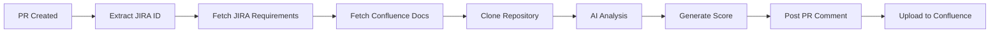

# AI Test Quality Analyzer

[](https://github.com/marketplace/actions/check-unit-test-cases-quality)
[](https://github.com/sourcefuse/ai-test-quality-analyzer/releases)
[](LICENSE)

An intelligent GitHub Action that automatically analyzes the quality of unit test cases in your codebase by comparing them against JIRA requirements and Confluence documentation using AI-powered analysis.

## 🎯 Features

- **Automated Test Quality Scoring**: Generates a comprehensive quality score (0-10) for your test suite
- **JIRA Integration**: Fetches requirements directly from JIRA tickets
- **Confluence Integration**: Analyzes related documentation for complete context
- **AI-Powered Analysis**: Uses AWS Bedrock with Claude for intelligent test evaluation
- **PR Comments**: Automatically posts detailed reports as pull request comments
- **Detailed Reporting**: Provides actionable insights and improvement recommendations
- **Configurable Thresholds**: Set minimum quality scores for your workflow

## 📊 Sample Report

When the action runs, it generates a comprehensive report that includes:

```
## ✅ Unit Test Quality Report

**JIRA Ticket:** BB-1234
**Branch:** feature/BB-1234-new-feature

### 📊 Quality Score

████████░░ 8.0/10

| Metric | Score |
|--------|-------|
| Test Quality Score | **8.0/10** |
| Minimum Threshold | 6.0/10 |
| Status | **PASSED** |
```

## 🚀 Quick Start

### 1. Add Workflow to Your Repository

Create `.github/workflows/check-unit-testcases.yml`:

```yaml
name: Check Unit Test Cases Quality

on:
  pull_request:
    branches:
      - dev
    types: [opened, synchronize, reopened]

jobs:
  analyze-test-quality:
    name: Analyze Test Quality
    runs-on: ubuntu-latest
    
    permissions:
      contents: read
      pull-requests: write
      issues: write
    
    steps:
      - name: Checkout repository
        uses: actions/checkout@v4
        with:
          fetch-depth: 0

      - name: Extract JIRA ticket
        id: extract_ticket
        run: |
          # Extract ticket from branch name or PR title
          if [[ "${{ github.head_ref }}" =~ ([A-Z]+-[0-9]+) ]]; then
            TICKET_ID="${BASH_REMATCH[1]}"
          fi
          echo "ticket_id=$TICKET_ID" >> $GITHUB_OUTPUT

      - name: Run Unit Test Quality Analysis
        uses: sourcefuse/ai-test-quality-analyzer@QCV1.0
        with:
          jira_url: ${{ secrets.UT_QUALITY_JIRA_URL }}
          jira_email: ${{ secrets.UT_QUALITY_JIRA_EMAIL }}
          jira_api_token: ${{ secrets.UT_QUALITY_JIRA_API_TOKEN }}
          jira_ticket_id: ${{ steps.extract_ticket.outputs.ticket_id }}
          confluence_url: ${{ secrets.UT_QUALITY_CONFLUENCE_URL }}
          confluence_email: ${{ secrets.UT_QUALITY_CONFLUENCE_EMAIL }}
          confluence_api_token: ${{ secrets.UT_QUALITY_CONFLUENCE_API_TOKEN }}
          aws_access_key_bedrock: ${{ secrets.UT_QUALITY_AWS_ACCESS_KEY_BEDROCK }}
          aws_secret_key_bedrock: ${{ secrets.UT_QUALITY_AWS_SECRET_KEY_BEDROCK }}
          minimum_score: '6.0'
```

### 2. Configure Secrets

Add required secrets in your repository settings:

- `UT_QUALITY_JIRA_URL` - Your JIRA instance URL
- `UT_QUALITY_JIRA_EMAIL` - JIRA user email
- `UT_QUALITY_JIRA_API_TOKEN` - JIRA API token
- `UT_QUALITY_CONFLUENCE_URL` - Confluence URL
- `UT_QUALITY_CONFLUENCE_EMAIL` - Confluence email
- `UT_QUALITY_CONFLUENCE_API_TOKEN` - Confluence API token
- `UT_QUALITY_AWS_ACCESS_KEY_BEDROCK` - AWS access key
- `UT_QUALITY_AWS_SECRET_KEY_BEDROCK` - AWS secret key

### 3. Create Pull Request

The action automatically triggers when you:
- Create a PR to your configured branch
- Include a JIRA ticket ID in branch name or PR title (e.g., `feature/BB-1234-description`)

## 📋 How It Works



1. **Requirement Gathering**: Fetches requirements from JIRA and related Confluence pages
2. **Code Analysis**: Examines test files in your repository
3. **AI Evaluation**: Uses Claude to assess test quality against requirements
4. **Score Generation**: Calculates quality score based on multiple factors
5. **Report Creation**: Generates detailed analysis with recommendations
6. **Result Posting**: Adds comment to PR and optionally uploads to Confluence

## 📈 Quality Metrics

The analyzer evaluates tests across five key dimensions:

| Category | Weight | Focus Areas |
|----------|--------|-------------|
| **Test Coverage** | 20% | Requirement coverage, missing scenarios |
| **Test Quality** | 20% | Assertions, test structure, clarity |
| **Edge Cases** | 20% | Error handling, boundary conditions |
| **Assertions** | 20% | Quality and completeness of checks |
| **Maintainability** | 20% | Code organization, documentation |

## 🔧 Configuration Options

### Action Inputs

| Input | Required | Default | Description |
|-------|----------|---------|-------------|
| `jira_ticket_id` | Yes | - | JIRA ticket to analyze |
| `minimum_score` | No | `6.0` | Minimum acceptable score |
| `save_to_file` | No | `true` | Save results to files |
| `upload_to_confluence` | No | `true` | Upload to Confluence |
| `repository_branch` | No | `main` | Branch to analyze |

### Environment Variables

Configure via GitHub Variables (optional):

- `UT_QUALITY_JIRA_PROJECT_KEY` - Default JIRA project (default: `BB`)
- `UT_QUALITY_CONFLUENCE_SPACE_KEY` - Default Confluence space (default: `BB`)
- `UT_QUALITY_MINIMUM_SCORE` - Global minimum score (default: `1.0`)
- `UT_QUALITY_CLAUDE_CODE_USE_BEDROCK` - Use Bedrock (default: `1`)

## 🛠️ Setup Script

For automated setup, use the provided script:

```bash
# Clone the repository
git clone https://github.com/sourcefuse/ai-test-quality-analyzer.git
cd ai-test-quality-analyzer

# Create .env file with your credentials
cp .env.example .env
# Edit .env with your values

# Run setup script
chmod +x setup-github-secrets.sh
./setup-github-secrets.sh
```

The script will:
- Verify GitHub CLI authentication
- Configure all required secrets
- Set up optional variables
- Provide setup confirmation

## 📝 Example Use Cases

### 1. Enforce Quality Standards

```yaml
- name: Run Unit Test Quality Analysis
  uses: sourcefuse/ai-test-quality-analyzer@QCV1.0
  with:
    minimum_score: '7.0'  # Require high quality
    
- name: Fail if quality is low
  if: steps.quality_check.outputs.score_passed == 'false'
  run: exit 1
```

### 2. Different Standards per Branch

```yaml
minimum_score: ${{ 
  github.base_ref == 'main' && '8.0' ||
  github.base_ref == 'dev' && '6.0' ||
  '4.0'
}}
```

### 3. Manual Analysis

Trigger manually from Actions tab with custom parameters:
- Specific JIRA ticket
- Custom quality threshold
- Target branch

## 📊 Output Examples

### PR Comment Format

The action posts a formatted comment with:
- Visual score indicator
- Pass/fail status
- Score breakdown
- Links to detailed reports
- Improvement suggestions

### Confluence Report

Uploaded reports include:
- Complete requirements mapping
- Test coverage analysis
- Code quality assessment
- Specific improvement recommendations
- Example code snippets

## 🔍 Troubleshooting

### Common Issues

| Issue | Solution |
|-------|----------|
| "Cannot find JIRA ticket" | Ensure branch/PR contains ticket ID (e.g., `BB-1234`) |
| "AWS authentication failed" | Verify Bedrock credentials and region |
| "Confluence upload failed" | Check API token permissions |
| "Score below threshold" | Review report for improvement areas |

### Debug Mode

Enable detailed logging:

```yaml
env:
  ACTIONS_RUNNER_DEBUG: true
  ACTIONS_STEP_DEBUG: true
```

## 🔒 Security

- All credentials stored as GitHub Secrets
- API tokens should have minimal required permissions
- Rotate tokens every 90 days
- Use dedicated service accounts
- Enable GitHub secret scanning

## 📦 Development

### Local Testing

```bash
# Install dependencies
npm install

# Set up environment
cp .env.example .env
# Add your credentials to .env

# Run analysis
npm run start
npm run create-requirement-doc
npm run analyze-test-quality
```

### Project Structure

```
├── action.yml              # GitHub Action definition
├── fetch-and-analyze.ts    # Main analysis orchestrator
├── src/
│   ├── services/          # Core services
│   │   ├── jira.service.ts
│   │   ├── confluence.service.ts
│   │   ├── bedrock-ai.service.ts
│   │   └── requirement-analyzer.service.ts
│   ├── dtos/              # Data transfer objects
│   ├── models/            # Data models
│   └── utils/             # Utility functions
├── templates/             # Workflow templates
├── prompts/              # AI prompt templates
└── setup-github-secrets.sh # Setup automation
```

## 🤝 Contributing

We welcome contributions! Please see our [Contributing Guide](CONTRIBUTING.md) for details.

1. Fork the repository
2. Create a feature branch
3. Commit your changes
4. Push to the branch
5. Open a Pull Request

## 📄 License

This project is licensed under the ISC License - see the [LICENSE](LICENSE) file for details.

## 👥 Support

- **Issues**: [GitHub Issues](https://github.com/sourcefuse/ai-test-quality-analyzer/issues)
- **Discussions**: [GitHub Discussions](https://github.com/sourcefuse/ai-test-quality-analyzer/discussions)
- **Documentation**: [Setup Guide](SETUP.md)

## 🙏 Acknowledgments

- Built with [AWS Bedrock](https://aws.amazon.com/bedrock/) and [Claude](https://www.anthropic.com/claude)
- Integrates with [Atlassian JIRA](https://www.atlassian.com/software/jira) and [Confluence](https://www.atlassian.com/software/confluence)
- Powered by [GitHub Actions](https://github.com/features/actions)

## 📈 Roadmap

- [ ] Support for multiple testing frameworks
- [ ] Integration with code coverage tools
- [ ] Custom quality rubrics
- [ ] Performance testing analysis
- [ ] Integration testing support
- [ ] Multi-language support

---

**Created by** [Vishal Gupta](https://github.com/vishalgupta2)

**Maintained by** [SourceFuse](https://github.com/sourcefuse)